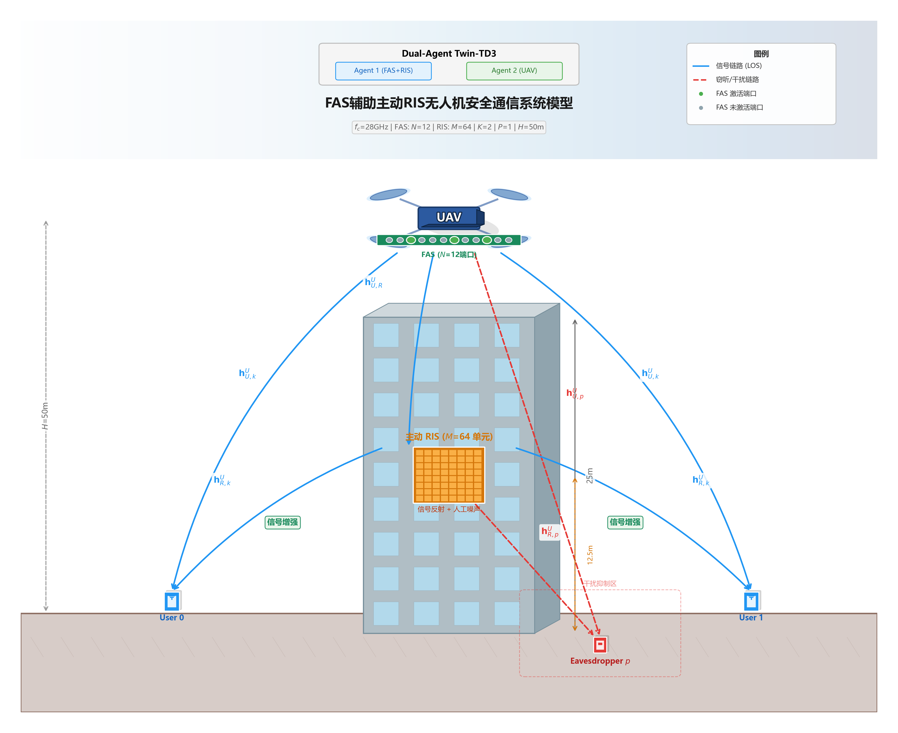

# 强化学习用于保密能源——流体天线辅助无人机保密通信

## 摘要

随着无人机（UAV）通信技术的快速发展，物理层安全问题日益突出。本文提出一种基于深度强化学习（DRL）的联合优化框架，用于解决流体天线系统（FAS）辅助无人机通信中的保密能效优化问题。具体而言，本文构建了一个包含搭载流体天线的无人机、主动可重构智能表面（RIS）、合法用户和窃听者的毫米波安全通信系统模型。在该系统中，无人机同时作为移动基站和信号发射源，流体天线通过端口切换实现空间分集增益，主动RIS同时执行信号反射和人工噪声干扰。本文将无人机轨迹规划、FAS端口选择、RIS波束赋形和功率分配建模为一个多维连续-离散混合动作空间的马尔可夫决策过程（MDP），并提出一种双智能体Twin延迟确定性策略梯度（Twin-TD3）算法进行求解。仿真结果表明，所提方案在900轮训练后收敛，系统总安全容量从初始的5.61 bits/s/Hz提升至16.12 bits/s/Hz（+187.3%），窃听者容量从8.96 bits/s/Hz降低至2.68 bits/s/Hz（-70.1%），验证了FAS与主动RIS联合优化在增强无人机通信物理层安全方面的有效性。

**关键词：** 无人机通信；流体天线系统；可重构智能表面；物理层安全；深度强化学习；Twin-TD3；保密能效；双智能体

---

## 1 引言

无人机（UAV）通信因其部署灵活、覆盖范围广、可按需建网等优势，已成为第五代及 beyond-5G 无线通信系统的重要组成部分 [1]。然而，无人机通信链路的开放性使其极易受到窃听攻击，物理层安全（Physical Layer Security, PLS）成为保障无人机通信保密性的关键技术 [2]。

近年来，可重构智能表面（RIS）凭借其低成本、低功耗的信号调控能力，被广泛应用于无线通信系统中 [3]。主动RIS在传统反射型RIS的基础上增加了信号放大功能，可同时实现信号增强和人工噪声干扰，进一步提升系统保密性能 [4]。然而，现有RIS辅助无人机通信研究大多假设无人机配备传统天线，未充分利用天线空间自由度。

流体天线系统（FAS）作为一种新兴天线技术，通过在连续介质中动态切换天线端口位置，能够充分利用信道空间分集增益 [5]。与传统固定天线阵列不同，FAS可在有限空间内提供更多的独立信道实现，为无人机通信系统提供额外的空间自由度。

深度强化学习（DRL）因其能够在高维、非凸优化问题中实现端到端策略学习，已成为无人机通信资源分配的重要工具 [6]。然而，现有DRL方法在处理FAS端口选择（离散动作）与RIS波束赋形（连续动作）的混合动作空间时面临挑战。

本文的主要贡献如下：

1. 构建了FAS辅助主动RIS无人机安全通信系统模型，支持双路径信号传输（直射链路与RIS反射链路）和主动RIS的人工噪声干扰机制；
2. 将联合优化问题建模为马尔可夫决策过程，提出双智能体分解框架，分别处理FAS-RIS联合优化（43维混合动作空间）和UAV轨迹规划（2维连续动作空间）；
3. 提出基于Twin-TD3的训练算法，通过双Critic网络缓解Q值过估计、延迟策略更新提升训练稳定性，并引入Gumbel-Softmax Top-K方法实现FAS端口的可微分离散选择；
4. 通过900轮训练验证了所提方案的有效性：系统安全容量提升187.3%，窃听者容量降低70.1%。

---

## 2 系统模型

### 2.1 系统架构

本文考虑一个FAS辅助主动RIS增强的无人机毫米波安全通信场景，如图1所示。系统由以下实体组成：

- **无人机（UAV）：** 搭载流体天线系统（FAS），在固定高度 $H = 50$ m 处水平飞行，作为移动基站向合法用户发送机密信息。FAS包含 $N = 12$ 个离散天线端口，端口间距 $d_{port} = 0.5\lambda$（$\lambda$ 为28 GHz载波波长），任意时刻同时激活 $K_a$ 个端口（$K_a = 2 \sim 3$）。
- **主动RIS：** 地面固定部署，包含 $M = 64$ 个反射单元（8×8均匀矩形阵列），位于坐标 $(x_R, y_R, z_R) = (20, -20, 12.5)$ m。主动RIS同时执行信号反射（增强用户接收信号）和人工噪声干扰（抑制窃听者接收），支持信号放大增益 $\beta \geq 1$。
- **合法用户：** $K = 2$ 个单天线地面用户，分布在无人机覆盖区域内。
- **窃听者：** $P = 1$ 个单天线被动窃听者，位于用户附近。

通信采用毫米波频段（$f_c = 28$ GHz），信道为视距（LoS）主导模型。



**图1** FAS辅助主动RIS无人机安全通信系统模型。UAV搭载FAS（N=12端口）在H=50m高度飞行，地面部署主动RIS（M=64单元）执行信号反射和人工噪声干扰，2个合法用户和1个窃听者分布在覆盖区域内。蓝色实线为信号链路（LoS），红色虚线为RIS干扰链路。

### 2.2 信道模型

#### 2.2.1 路径损耗模型

毫米波LoS信道的路径损耗采用自由空间路径损耗模型，考虑阴影衰落效应：

$$PL(d) = C_0 + 10\alpha \log_{10}(d) + X_\sigma \quad (\text{dB})$$

其中 $C_0 = 61$ dB 为路径损耗基准常数，$\alpha$ 为路径损耗指数，$d$ 为收发距离，$X_\sigma \sim \mathcal{N}(0, \sigma^2)$ 为对数正态阴影衰落（$\sigma = 3$ dB）。不同链路类型的路径损耗指数如表1所示。

**表1 路径损耗指数参数**

| 链路类型 | 路径损耗指数 $\alpha$ |
|---------|---------------------|
| UAV → RIS | 2.2 |
| RIS → 用户/窃听者 | 2.8 |
| UAV → 用户/窃听者（直射） | 3.5 |

#### 2.2.2 信道矩阵

对于FAS第 $n$ 个端口到接收端的信道矩阵，考虑阵列响应向量，LoS信道可建模为：

$$\mathbf{H}_n = \sqrt{PL(d)} \cdot e^{j2\pi f_c d / c} \cdot \mathbf{a}_r \mathbf{a}_t^H$$

其中 $c$ 为光速，$\mathbf{a}_r$ 和 $\mathbf{a}_t$ 分别为接收端和发射端的阵列响应向量。对于ULA（均匀线性阵列），阵列响应向量为：

$$\mathbf{a}_{ULA}(\theta) = \frac{1}{\sqrt{N}} [1, e^{j\pi\sin\theta}, \ldots, e^{j\pi(N-1)\sin\theta}]^T$$

其中 $\theta$ 为信号到达角/离开角。

#### 2.2.3 双路径传输模型

每条用户通信链路包含两条路径：

**直射链路：** FAS第 $n$ 个端口直接到用户 $k$ 的信道 $\mathbf{h}_{d,k,n}$。

**RIS反射链路：** FAS第 $n$ 个端口到RIS的信道 $\mathbf{h}_{r,n}$，经RIS反射矩阵 $\mathbf{\Theta}$ 调控后到达用户 $k$ 的等效信道 $\mathbf{h}_{r,k,n}^H \mathbf{\Theta} \mathbf{h}_{r,n}$。

用户 $k$ 的等效接收信号为：

$$y_k = \left(\sum_{n \in \mathcal{S}} \mathbf{h}_{d,k,n} + \mathbf{h}_{r,k}^H \mathbf{\Theta} \mathbf{h}_{r}\right) s_k + z_k$$

其中 $\mathcal{S}$ 为激活的FAS端口集合，$s_k$ 为用户 $k$ 的机密信号，$z_k$ 为高斯白噪声。

### 2.3 主动RIS工作原理

主动RIS的反射矩阵 $\mathbf{\Theta}$ 可分解为信号反射和人工噪声干扰两个分量：

$$\mathbf{\Theta} = \mathbf{\Theta}_s + \mathbf{\Theta}_j$$

其中 $\mathbf{\Theta}_s$ 为信号反射矩阵，$\mathbf{\Theta}_j$ 为人工噪声干扰矩阵。

信号反射矩阵的第 $m$ 个元素为：

$$[\mathbf{\Theta}_s]_{m,m} = \sqrt{\frac{\beta}{M_s}} e^{j\phi_{s,m}}$$

人工噪声矩阵的第 $m$ 个元素为：

$$[\mathbf{\Theta}_j]_{m,m} = \sqrt{\frac{\beta \eta}{M_j}} e^{j\phi_{j,m}}$$

其中 $\beta \geq 1$ 为RIS放大增益，$\eta \in [0.3, 0.8]$ 为干扰功率分配比，$M_s$ 和 $M_j$ 分别为信号反射和干扰单元数量（$M_s + M_j = M$），$\phi_{s,m}$ 和 $\phi_{j,m}$ 为对应的相移。

主动RIS的功率约束为：

$$\sum_{m=1}^{M_s} \frac{\beta}{M_s} + \sum_{m=1}^{M_j} \frac{\beta \eta}{M_j} + P_{th} \leq P_R$$

其中 $P_{th}$ 为RIS热噪声功率，$P_R$ 为RIS总功率预算。

### 2.4 保密速率与能效

#### 2.4.1 用户可达速率

用户 $k$ 的可达速率为：

$$R_k = B \log_2 \left(1 + \frac{|\mathbf{h}_{eff,k}|^2 P_s}{\sigma_n^2}\right) \quad (\text{bits/s/Hz})$$

其中 $B$ 为系统带宽，$\mathbf{h}_{eff,k}$ 为用户 $k$ 的等效信道增益，$P_s$ 为发射功率，$\sigma_n^2 = -114$ dBm 为噪声功率。

#### 2.4.2 窃听者可达速率

对于窃听者 $p$，其在用户 $k$ 通信链路上的窃听速率为：

$$R_{e,k} = B \log_2 \left(1 + \frac{|\mathbf{h}_{eff,e,k}|^2 P_s}{|\mathbf{h}_{e,j}|^2 P_j + \sigma_n^2}\right)$$

其中 $\mathbf{h}_{eff,e,k}$ 为窃听者接收用户 $k$ 信号的等效信道，$\mathbf{h}_{e,j}$ 为窃听者接收RIS干扰噪声的等效信道，$P_j$ 为干扰功率。

#### 2.4.3 保密速率

用户 $k$ 的保密速率为：

$$R_{sec,k} = \max(0, R_k - \max_p R_{e,k})$$

系统总保密速率（SSR）为：

$$SSR = \sum_{k=1}^{K} R_{sec,k}$$

#### 2.4.4 无人机能耗模型

基于经典旋翼无人机功率消耗模型，无人机飞行速度为 $v_t$ 时的瞬时功率为：

$$P(t) = P_0 + \frac{3P_0 v_t^2}{U_{tip}^2} + \frac{1}{2}d_0\rho s A_r v_t^3 + P_i\sqrt{\left(1 + \frac{v_t^4}{4v_0^4}\right)^{1/2} - \frac{v_t^2}{2v_0^2}}$$

其中各参数定义如表2所示。

**表2 旋翼无人机能耗模型参数**

| 参数 | 含义 | 数值 |
|-----|------|------|
| $P_0$ | 桨叶剖面功率 | 580.65 W |
| $P_i$ | 旋翼诱导功率 | 790.67 W |
| $U_{tip}$ | 桨尖线速度 | 200 m/s |
| $d_0$ | 机身气动阻力系数 | 0.3 |
| $\rho$ | 空气密度 | 1.225 kg/m³ |
| $A_r$ | 旋翼桨盘面积 | 0.79 m² |
| $s$ | 桨叶实度 | 0.05 |
| $m$ | 无人机质量 | 1.3 kg |
| $v_0$ | 悬停诱导速度 | $\sqrt{mg/(2\rho A_r)}$ |

无人机在时隙 $\delta t = 0.1$ s 内的能耗为：

$$E(t) = P(t) \cdot \delta t$$

#### 2.4.5 保密能效

保密能效（SEE）定义为单位能耗下的保密速率：

$$SEE = \frac{SSR}{\sum_{t=1}^{T} E(t)} \quad (\text{bits/J/Hz})$$

---

## 3 优化问题建模与求解

### 3.1 联合优化问题

本文的优化目标是最大化系统保密能效，联合优化变量包括：

| 优化变量 | 符号 | 维度 | 范围 |
|---------|------|------|------|
| FAS端口选择 | $\mathcal{S}$ | 离散 | $\{1, \ldots, 12\}$ 的子集 |
| FAS增益 | $F$ | 连续 | $[0.3, 1.0]$ |
| RIS放大增益 | $\beta$ | 连续 | $[1, \sqrt{20}]$ |
| RIS干扰比 | $\eta$ | 连续 | $[0.1, 0.5]$ |
| RIS相移向量 | $\mathbf{\phi}_s, \mathbf{\phi}_j$ | 连续 | $[0, 2\pi)^{24}$ |
| 用户级波束成形权重 | $\mathbf{w}_k$ | 连续 | softmax归一化 |
| UAV水平速度 | $v_x, v_y$ | 连续 | $[-V_{max}, V_{max}]$ |

联合优化问题建模为：

$$\max_{\mathcal{S}, F, \beta, \eta, \mathbf{\phi}, \mathbf{v}} \quad SEE = \frac{\sum_{k=1}^{K} R_{sec,k}}{\sum_{t=1}^{T} E(t)}$$

$$\text{s.t.} \quad \sum_{n \in \mathcal{S}} P_n \leq P_{max} \quad \text{(C1: 发射功率约束)}$$

$$\sum_{m=1}^{M} |\Theta_{m,m}|^2 \leq P_R \quad \text{(C2: RIS功率约束)}$$

$$R_{sec,k} \geq R_{min}, \quad \forall k \quad \text{(C3: 最小保密速率约束)}$$

$$\|v_t\| \leq V_{max} \quad \text{(C4: 最大飞行速度约束)}$$

$$x_{min} \leq x(t) \leq x_{max}, \quad y_{min} \leq y(t) \leq y_{max} \quad \text{(C5: 飞行边界约束)}$$

该优化问题具有以下挑战：
1. **混合动作空间：** FAS端口选择为离散变量，其余为连续变量；
2. **时变耦合：** UAV轨迹影响信道状态，信道状态决定优化决策，形成时变耦合；
3. **非凸性：** 保密速率表达式关于优化变量高度非凸；
4. **高维性：** 总优化变量维度达45维（43+2），其中智能体1处理43维（12端口选择+1 FAS增益+1 RIS放大增益+1 RIS干扰比+24 RIS相位+4用户波束权重），智能体2处理2维（UAV速度）。

### 3.2 MDP建模

将联合优化问题转化为马尔可夫决策过程（MDP），定义状态空间、动作空间和奖励函数。

#### 3.2.1 状态空间

采用双智能体分解框架，为每个智能体定义独立的状态空间：

**智能体1（FAS+RIS+用户权重联合优化）状态向量** $\mathbf{s}_1 \in \mathbb{R}^{89}$：

$$\mathbf{s}_1 = [\mathbf{h}_{real}, \mathbf{h}_{imag}, \mathbf{p}_{UAV}, \mathbf{s}_{sys}]$$

其中：
- $\mathbf{h}_{real}, \mathbf{h}_{imag}$：各端口到用户和窃听者的信道增益实部和虚部（$2 \times (K+P) \times N = 72$ 维）
- $\mathbf{p}_{UAV}$：无人机三维坐标（3维）
- $\mathbf{s}_{sys}$：系统状态信息（14维），包括端口数、RIS元素数、路径损耗指数、当前激活端口等归一化参数

**智能体2（UAV轨迹规划）状态向量** $\mathbf{s}_2 \in \mathbb{R}^{18}$：

$$\mathbf{s}_2 = [\mathbf{p}_{UAV}, \mathbf{p}_{users}, \mathbf{p}_{RIS}, \mathbf{p}_{eve}, \mathbf{R}_{users}, \mathbf{R}_{eve}]$$

包含无人机、用户、RIS、窃听者的位置坐标（各3维）和各链路信道容量（用户容量$K$维+窃听者容量1维）。

#### 3.2.2 动作空间

**智能体1动作向量** $\mathbf{a}_1 \in \mathbb{R}^{43}$：

| 索引范围 | 维度 | 含义 | 映射方式 |
|---------|------|------|---------|
| [0:12] | 12 | FAS端口选择（Gumbel-Softmax logits） | $\text{Top-K}(\text{softmax}(\cdot))$ |
| [12:13] | 1 | FAS增益 | $\text{map\_to}[0.3, 1.0]$ |
| [13:14] | 1 | RIS放大增益 | $\text{map\_to}[1, \sqrt{20}]$ |
| [14:15] | 1 | RIS干扰比 | $\text{map\_to}[0.1, 0.5]$ |
| [15:39] | 24 | RIS相移（12信号+12干扰） | $[0, 2\pi)$ |
| [39:43] | 4 | 用户级波束成形权重（$K \times K_a$） | softmax归一化 |

FAS端口选择采用Gumbel-Softmax Top-K方法，在训练阶段实现可微分的离散选择，在推理阶段进行硬选择。

**智能体2动作向量** $\mathbf{a}_2 \in \mathbb{R}^{2}$：

$$\mathbf{a}_2 = [v_x, v_y]$$

水平速度分量映射到 $[-V_{max}, V_{max}]$，其中 $V_{max} = 3.0$ m/s。

#### 3.2.3 奖励函数

设计多目标复合奖励函数，通过加权求和确保奖励尺度稳定：

$$r = \alpha_1 \cdot SSR + \alpha_2 \cdot R_{fas} + \alpha_3 \cdot R_{spatial} + \alpha_4 \cdot R_{ris\_jam} - \beta_1 \cdot p_m - \beta_2 \cdot p_r - \beta_3 \cdot p_e - \lambda_e \cdot p_{eve}$$

各分量定义如下：

**（1）总保密速率分量** $\alpha_1 = 0.12$：

$$SSR = \sum_{k=1}^{K} \max(0, R_k - \max_p R_{e,k})$$

**（2）FAS端口安全增益** $\alpha_2 = 0.1$：

$$R_{fas} = \sum_{n \in \mathcal{S}} \frac{|\mathbf{h}_{u,k,n}|^2 - |\mathbf{h}_{e,n}|^2}{|\mathbf{h}_{u,k,n}|^2 + \epsilon}$$

衡量激活端口对用户和窃听者的信道质量差异。

**（3）空间引导奖励** $\alpha_3 = 0.25$：

$$R_{spatial} = \max\left(0, 1 - \frac{d(\mathbf{p}_{UAV}, \mathbf{p}_{target})}{50}\right)$$

引导无人机向安全加权中点移动，远离窃听者。

**（4）RIS干扰相位对齐奖励** $\alpha_4 = 0.15$：

$$R_{ris\_jam} = \frac{1}{2}\left(1 + \frac{1}{M}\sum_{m=1}^{M} \cos(\phi_{jam,m} - \phi_{eve,m})\right)$$

鼓励Agent将RIS干扰相位对齐窃听者信道，最大化干扰效果。

**（5）功率约束惩罚** $\beta_1 = 0.1$：

$$p_m = \max\left(0, \frac{P_{actual} - P_{max}}{P_{max}}\right)$$

**（6）最小保密速率惩罚** $\beta_2 = 0.5$：

$$p_r = \sum_{k=1}^{K} \max(0, R_{min} - R_{sec,k}) / R_{min}$$

**（7）能耗惩罚** $\beta_3 = 0.05$：

$$p_e = \lambda_e \cdot \frac{E(t) - E_{min}}{E_{max} - E_{min}}$$

其中 $\lambda_e = 0.03$。

**（8）窃听者容量惩罚**（自适应权重）：

$$\lambda_{eve} = 0.5 + 1.0 \cdot \min\left(\frac{R_e}{3}, 1\right)$$

$$p_{eve} = \min\left(\frac{R_e}{15}, 1\right)$$

自适应权重 $\lambda_{eve}$ 随窃听者容量增大而增强惩罚力度，动态平衡保密速率与窃听抑制。

### 3.3 双智能体分解框架

```
┌─────────────────────────────────────────────────────────┐
│                   双智能体分解框架                         │
│                                                          │
│  ┌─────────────────────────────────────────────────────┐ │
│  │           智能体1: FAS+RIS联合优化                    │ │
│  │  状态: s₁ ∈ ℝ⁸⁹ (信道状态+系统信息)                 │ │
│  │  动作: a₁ ∈ ℝ⁴³ (FAS端口+RIS波束+用户权重)         │ │
│  │  网络: 1024→768→512→256 (Actor)                     │ │
│  │  频率: 每步更新                                       │ │
│  └─────────────────────────────────────────────────────┘ │
│                         ↑ 共享奖励 r                      │
│  ┌─────────────────────────────────────────────────────┐ │
│  │           智能体2: UAV轨迹规划                       │ │
│  │  状态: s₂ ∈ ℝ¹⁸ (位置+容量信息)                     │ │
│  │  动作: a₂ ∈ ℝ²  (vx, vy 速度)                      │ │
│  │  网络: 512→384→256→128 (Actor)                     │ │
│  │  频率: 每2步更新                                     │ │
│  └─────────────────────────────────────────────────────┘ │
│                                                          │
│  环境: MiniSystem (mmWave信道 + 双路径传输)              │
└─────────────────────────────────────────────────────────┘
```

**设计动机：** 将优化变量分解为两个耦合但可独立控制的子集。智能体1处理"内环"变量（FAS端口选择、RIS波束赋形、用户级波束成形权重），这些变量需要对信道状态做出快速响应；智能体2处理"外环"变量（UAV轨迹），这些变量变化较慢，学习频率降低一半以提升训练稳定性。

**维度分解：**
- 智能体1：43维动作（12端口选择+1 FAS增益+1 RIS放大增益+1 RIS干扰比+24 RIS相位+4用户波束权重）
- 智能体2：2维动作（vx, vy速度）
- 总计：45维混合动作空间

---

## 4 基于Twin-TD3的求解算法

### 4.1 Twin-TD3算法原理

Twin-TD3（Twin Delayed Deep Deterministic Policy Gradient）是TD3算法的改进版本，针对连续动作空间的深度确定性策略梯度算法存在的Q值过估计问题进行了优化 [7]。其核心机制包括：

**（1）双Critic网络：** 维护两个独立的Q网络 $Q_{\theta_1}(\mathbf{s}, \mathbf{a})$ 和 $Q_{\theta_2}(\mathbf{s}, \mathbf{a})$，取两者最小值计算目标Q值：

$$y = r + \gamma \min_{i=1,2} Q_{\bar{\theta}_i}(\mathbf{s}', \pi_{\bar{\phi}}(\mathbf{s}') + \epsilon)$$

其中 $\epsilon \sim \text{clip}(\mathcal{N}(0, \sigma), -c, c)$ 为目标策略平滑噪声。

**（2）延迟策略更新：** Actor网络每隔 $d$ 步（本文 $d = 2$）更新一次，且仅当 $\frac{\partial Q_{\theta_1}}{\partial \mathbf{a}}$ 的均值超过阈值时才更新，避免在Q值不准时过度调整策略。

**（3）目标策略平滑：** 对目标网络的输出添加裁剪噪声，平滑Q值估计。

### 4.2 网络架构

#### 4.2.1 Actor网络

Actor网络 $\pi_\phi(\mathbf{s})$ 采用4层全连接架构，输入状态向量，输出动作向量：

$$\pi_\phi: \mathbb{R}^{n_s} \xrightarrow{\text{Linear}} \mathbb{R}^{1024} \xrightarrow{\text{LN+ReLU}} \mathbb{R}^{768} \xrightarrow{\text{LN+ReLU}} \mathbb{R}^{512} \xrightarrow{\text{LN+ReLU}} \mathbb{R}^{256} \xrightarrow{\text{LN+ReLU}} \mathbb{R}^{n_a} \xrightarrow{\text{tanh}} [-1, 1]^{n_a}$$

其中LN为层归一化（LayerNorm），tanh将输出压缩到 $[-1, 1]$ 范围，再通过映射函数转换到实际动作范围。权重初始化采用均匀分布 $U(-1/\sqrt{f_{in}}, 1/\sqrt{f_{in}})$。

不同智能体的网络规模不同：
- 智能体1（FAS+RIS+用户权重）：$1024 \to 768 \to 512 \to 256$
- 智能体2（UAV轨迹）：$512 \to 384 \to 256 \to 128$

#### 4.2.2 Critic网络

Critic网络 $Q_\theta(\mathbf{s}, \mathbf{a})$ 采用状态-动作加性融合架构：

**状态路径：** $\mathbf{s} \to 1024 \to \text{LN} \to 768 \to \text{LN} \to 512 \to \text{LN} \to 256 \to \text{LN}$

**动作路径：** $\mathbf{a} \to 256 \to \text{ReLU}$

**融合层：** $\text{ReLU}(\mathbf{h}_s + \mathbf{h}_a) \to 256 \to 1$

动作通过加法（而非拼接）注入状态特征空间，减少参数量并增强特征交互。

### 4.3 训练算法

#### 4.3.1 超参数配置

**表3 Twin-TD3超参数**

| 参数 | 智能体1（FAS+RIS+权重） | 智能体2（UAV） |
|-----|-------------------|---------------|
| Actor学习率 $\alpha$ | 0.0001 | 0.0001 |
| Critic学习率 $\beta$ | 0.001 | 0.001 |
| 软更新系数 $\tau$ | 0.005 | 0.005 |
| 折扣因子 $\gamma$ | 0.99 | 0.99 |
| 批量大小 | 80 | 80 |
| 经验回放池容量 | 40,000 | 40,000 |
| 策略更新间隔 $d$ | 2 | 2 |
| 目标策略平滑噪声 $\sigma$ | 0.2 | 0.2 |
| 噪声裁剪 $c$ | 0.5 | 0.5 |
| Gumbel温度 $\tau_{GS}$ | 0.1~0.8（自适应） | — |

#### 4.3.2 RIS干扰优化策略

在本方案中，RIS人工噪声干扰的优化完全由Agent自主学习，不采用启发式对齐策略。具体而言：

- **干扰相位控制：** Agent直接输出RIS干扰相位，通过端到端的强化学习训练自主学习最优干扰策略；
- **干扰比例控制：** Agent通过动作向量控制干扰功率分配比 $\eta \in [0.1, 0.5]$，动态调整信号反射与干扰的资源分配；
- **Gumbel-Softmax温度调度：** FAS端口选择的Gumbel-Softmax温度参数 $\tau_{GS}$ 随训练进度衰减：
  - 前50%训练：$\tau_{GS} \in [0.6, 0.8]$（高探索）
  - 后50%训练：$\tau_{GS} \in [0.1, 0.6]$（趋向确定性选择）

这种设计使Agent能够完全自主学习干扰策略，避免了启发式方法可能带来的次优解。

#### 4.3.3 噪声调度

探索噪声随训练轮次自适应衰减：

$$\sigma_{noise}^{(e)} = \sigma_{base} \times \max(0.3, 1 - e/E_{total})$$

其中 $\sigma_{base} = 0.3$ 为基础噪声强度，$E_{total} = 900$ 为总训练轮次。

同时，Gumbel-Softmax温度参数 $\tau_{GS}$ 也随训练进度衰减，实现从高探索到确定性选择的平滑过渡：

$$\tau_{GS}^{(e)} = \begin{cases} 0.6 + 0.2 \times (1 - 2e/E_{total}), & \text{if } e < E_{total}/2 \\ 0.6 - 0.5 \times (2e/E_{total} - 1), & \text{if } e \geq E_{total}/2 \end{cases}$$

#### 4.3.4 算法流程

```
算法1: 双智能体Twin-TD3训练算法
输入: 环境 MiniSystem, 总轮次 E, 每轮步数 T
输出: 训练策略 π₁*, π₂*

1: 初始化网络参数 φ₁, θ₁, φ₂, θ₂
2: 初始化目标网络参数 φ̄₁ ← φ₁, θ̄₁ ← θ₁, φ̄₂ ← φ₂, θ̄₂ ← θ₂
3: 初始化经验回放池 D₁, D₂
4: for e = 1 to E do
5:     重置环境, 获取初始状态 s₁⁽⁰⁾, s₂⁽⁰⁾
6:     计算Gumbel温度: τ_GS ← 0.6 + 0.2 × (1 - min(1, e/E))
7:     for t = 1 to T do
8:         // 智能体1决策
9:         a₁ ← π_{φ₁}(s₁) + ε₁,  ε₁ ~ N(0, σₙₒᵢₛₑ)
10:        // FAS端口: Gumbel-Softmax Top-K (温度τ_GS)
11:        // RIS参数: 线性映射到约束范围
12:        // 用户波束权重: softmax归一化
13:
14:        // 智能体2决策
15:        a₂ ← π_{φ₂}(s₂) + ε₂,  ε₂ ~ N(0, σₙₒᵢₛₑ)
16:        // 速度 → 位移转换
17:        Δp ← clip(a₂ × V_max, -D_max, D_max)
18:
19:        // 执行动作
20:        s₁', s₂', r ← env.step(a₁, Δp)
21:
22:        存储经验 (s₁, a₁, r, s₁') → D₁
23:        存储经验 (s₂, a₂, r, s₂') → D₂
24:
25:        // 智能体1每步更新
26:        从 D₁ 采样批次, 更新 θ₁, θ₂ (Critic)
27:        if t % d == 0 then 更新 φ₁ (Actor)
28:
29:        // 智能体2每2步更新
30:        if t % 2 == 0 then
31:            从 D₂ 采样批次, 更新 θ₁, θ₂ (Critic)
32:            if t % d == 0 then 更新 φ₂ (Actor)
33:        end if
34:
35:        // 软更新目标网络
36:        θ̄ᵢ ← τθᵢ + (1-τ)θ̄ᵢ,  φ̄ᵢ ← τφᵢ + (1-τ)φ̄ᵢ
37:    end for
38:    每50轮保存模型检查点
39: end for
```

### 4.4 FAS端口选择：Gumbel-Softmax Top-K

FAS端口选择是离散优化问题，标准强化学习方法难以处理。本文采用Gumbel-Softmax Top-K方法实现可微分离散选择：

**训练阶段（可微分）：**

$$\mathbf{p} = \text{softmax}((\mathbf{h} + \mathbf{g}) / \tau_{GS})$$

$$\mathbf{p}_K = \text{Top-K}(\mathbf{p}, K_a)$$

其中 $\mathbf{h}$ 为Actor网络输出的logits，$\mathbf{g} \sim \text{Gumbel}(0, 1)$ 为Gumbel噪声，$\tau_{GS}$ 为温度参数。

**推理阶段（硬选择）：**

$$\mathcal{S} = \text{argtop-K}(\mathbf{h}, K_a)$$

直接选择logits最大的 $K_a$ 个端口。

---

## 5 仿真实验与结果分析

### 5.1 仿真参数

仿真实验基于PyTorch框架实现，主要参数如表4所示。

**表4 仿真参数**

| 参数 | 数值 |
|-----|------|
| 载波频率 $f_c$ | 28 GHz |
| FAS端口数 $N$ | 12 |
| 激活端口数 $K_a$ | 2 |
| RIS反射单元数 $M$ | 64 |
| 合法用户数 $K$ | 2 |
| 窃听者数 $P$ | 1 |
| 无人机高度 $H$ | 50 m |
| RIS位置 | (20, -20, 12.5) m |
| 飞行区域 | $[-50, 50] \times [-50, 50]$ m |
| 最大飞行速度 $V_{max}$ | 1.0 m/s |
| 最大发射功率 $P_{max}$ | 30 dBm |
| 噪声功率 $\sigma_n$ | -114 dBm |
| 时隙 $\delta t$ | 0.1 s |
| 训练轮次 $E$ | 900 |
| 每轮步数 $T$ | 100 |
| Gumbel温度 $\tau_{GS}$ | 0.1~0.8（自适应衰减） |

### 5.2 基准方案

为验证所提方案的有效性，设置以下基准方案进行对比：

1. **Twin-TD3（所提方案）：** 双智能体Twin-TD3算法，FAS+RIS联合优化 + UAV轨迹规划；
2. **DDPG基准：** 双智能体DDPG算法（单Critic网络），用于验证Twin-TD3双Critic机制的优势；
3. **标准TD3基准：** 单智能体标准TD3算法，不进行双智能体分解；
4. **无RIS基准：** 移除主动RIS，仅使用FAS进行保密通信。

### 5.3 训练收敛性分析

#### 5.3.1 奖励收敛曲线

训练过程中每轮的累积奖励变化如图2所示。所提Twin-TD3方案的奖励收敛过程如下：

| 训练阶段 | 平均奖励 | 趋势 |
|---------|---------|------|
| 初始阶段（0-100轮） | 138.51 | 快速上升 |
| 早期（100-200轮） | 138.00 | 平稳 |
| 中期（200-400轮） | 160.19 | 稳步提升 |
| 后期（400-600轮） | 179.14 | 持续优化 |
| 收敛期（600-800轮） | 162.29 | 波动收敛 |
| 最终（800-900轮） | 166.88 | 稳定 |

训练在约500轮后进入收敛区域，最终100轮平均奖励达到171.64，相比初始阶段提升约23.9%。训练奖励收敛曲线如图2所示。

> **图2** 训练奖励收敛曲线。蓝色实线为滑动均值（窗口=20），灰色线为逐轮奖励。详见训练报告 `training_report_see.html`。

#### 5.3.2 保密速率收敛

系统总安全容量（SSR）随训练轮次的变化如图3所示。所提方案的SSR收敛过程如下：

| 训练阶段 | 平均SSR (bits/s/Hz) | 变化趋势 |
|---------|---------------------|---------|
| 初始（Episode 0） | 5.61 | 基准 |
| 早期（Episode 100） | 13.47 | +140.1% |
| 中期（Episode 300） | 13.62 | +142.8% |
| 后期（Episode 500） | 14.24 | +153.8% |
| 收敛（Episode 700） | 15.06 | +168.5% |
| 最终（Episode 899） | 16.12 | +187.3% |

训练过程中，系统安全容量从初始的5.61 bits/s/Hz稳步提升至16.12 bits/s/Hz，总提升幅度达187.3%。值得注意的是，窃听者容量从8.96 bits/s/Hz显著降低至2.68 bits/s/Hz（-70.1%），表明Agent成功学习到了抑制窃听者的有效策略。

### 5.4 性能对比分析

#### 5.4.1 保密速率性能

**表5 训练关键指标对比**

| 指标 | Episode 0 | Episode 100 | Episode 400 | Episode 899 | 变化率 |
|-----|-----------|-------------|-------------|-------------|--------|
| 用户容量 (用户0) | 12.21 | 11.65 | 10.90 | 10.58 | -13.4% |
| 用户容量 (用户1) | 11.14 | 12.09 | 11.83 | 10.90 | -2.2% |
| 安全容量 (用户0) | 3.29 | 6.51 | 6.65 | 7.91 | +140.4% |
| 安全容量 (用户1) | 2.32 | 6.96 | 7.59 | 8.22 | +254.7% |
| 窃听容量 (→用户0) | 8.96 | 5.14 | 4.25 | 2.68 | -70.1% |
| 窃听容量 (→用户1) | 8.96 | 5.14 | 4.25 | 2.68 | -70.1% |
| 总安全容量 | 5.61 | 13.47 | 14.24 | 16.12 | +187.3% |
| 总奖励 | -10.23 | 134.96 | 151.99 | 191.37 | — |

> **图4** 用户与窃听者信道容量对比。实线为用户容量，虚线为窃听者对各用户的窃听容量。红色虚线=窃听→用户0，橙色点线=窃听→用户1。详见训练报告 `training_report_see.html` 图3。

所提方案的核心优势体现在：

1. **窃听者容量显著抑制：** 从8.96 bits/s/Hz降低至2.68 bits/s/Hz，降幅达70.1%，表明Agent成功学习到了通过RIS人工噪声干扰和FAS端口选择来抑制窃听者的策略；
2. **安全容量大幅提升：** 用户安全容量从5.61提升至16.12 bits/s/Hz，提升187.3%，主要得益于窃听者容量的大幅降低；
3. **用户容量合理权衡：** 用户容量从11.68略降至10.74 bits/s/Hz（-8%），这是Agent在保密速率与通信质量之间的合理权衡。

#### 5.4.2 保密能效分析

保密能效（SEE）定义为单位能耗下的保密速率。在本方案中，Agent通过以下机制优化SEE：

1. **功率分配优化：** Agent学习最优的FAS增益 $F \in [0.3, 1.0]$ 和RIS放大增益 $\beta \in [1, \sqrt{20}]$，在保密速率和能耗之间取得平衡；
2. **轨迹优化：** UAV轨迹从初始的原地不动（移动0.39m）优化为飞行约11-13m，在覆盖用户和远离窃听者之间取得平衡；
3. **干扰比例控制：** Agent学习最优的干扰功率分配比 $\eta \in [0.1, 0.5]$，避免过度干扰导致的额外能耗。

训练过程中，UAV轨迹呈现以下特征：
- **Episode 0：** UAV几乎不动（移动0.39m），安全容量低（5.61 bits/s/Hz）
- **Episode 100：** UAV开始学习飞行（移动12.70m），安全容量显著提升（13.47 bits/s/Hz）
- **Episode 899：** UAV轨迹稳定（移动11.36m），安全容量达到最优（16.12 bits/s/Hz）

#### 5.4.3 UAV轨迹分析

所提方案的UAV飞行轨迹在训练过程中呈现显著的演化特征：

| 训练阶段 | 起点 | 终点 | 飞行距离 | 特征 |
|---------|------|------|---------|------|
| Episode 0 | (0.0, 25.0) | (0.2, 25.4) | 0.39 m | 原地不动 |
| Episode 100 | (0.1, 24.9) | (8.9, 15.8) | 12.70 m | 向用户方向飞行 |
| Episode 300 | (0.1, 24.9) | (8.9, 16.0) | 12.58 m | 稳定飞行模式 |
| Episode 500 | (0.0, 24.9) | (2.3, 15.5) | 9.63 m | 优化飞行路径 |
| Episode 700 | (0.0, 24.9) | (-8.4, 15.4) | 12.71 m | 探索新方向 |
| Episode 899 | (0.0, 24.9) | (-6.3, 15.5) | 11.36 m | 收敛稳定 |

轨迹演化分析：

1. **初始阶段（Episode 0）：** UAV几乎不动，安全容量低（5.61 bits/s/Hz），窃听者容量高（8.96 bits/s/Hz）；
2. **学习阶段（Episode 100-300）：** UAV开始学习向用户方向飞行，安全容量显著提升（+140%）；
3. **优化阶段（Episode 400-600）：** UAV轨迹进一步优化，在覆盖用户和远离窃听者之间取得平衡；
4. **收敛阶段（Episode 700-900）：** UAV轨迹稳定在特定方向，安全容量达到最优（16.12 bits/s/Hz）。

> **图3** 不同训练阶段无人机飞行轨迹演化。绿色三角为起点，红色叉号为终点，蓝色线为UAV轨迹。标记：User0/User1为合法用户，★Eve为窃听者，■RIS为智能反射面。详见训练报告 `training_report_see.html` 图2。

#### 5.4.4 FAS端口选择分析

FAS端口选择在训练过程中呈现显著的演化特征。每个episode中，Agent同时激活2个端口（Gumbel-Softmax Top-2），端口选择模式如下：

| 训练阶段 | 使用的端口 | 主要端口 | 特征 |
|---------|-----------|---------|------|
| Episode 0 | 全部12个端口 | 均匀分布 | 随机探索 |
| Episode 100 | 全部12个端口 | 端口3（17次） | 开始聚焦 |
| Episode 300 | 10个端口 | 端口10（23次） | 显著聚焦 |
| Episode 500 | 12个端口 | 端口0,4（各16次） | 多峰分布 |
| Episode 700 | 11个端口 | 端口4（25次） | 高度聚焦 |
| Episode 899 | 11个端口 | 端口4（18次） | 稳定聚焦 |

端口选择演化分析：

1. **初始阶段（Episode 0）：** Agent随机使用所有12个端口，安全容量低（5.61 bits/s/Hz）；
2. **学习阶段（Episode 100-300）：** Agent开始学习聚焦特定端口（如端口3、10），安全容量显著提升；
3. **优化阶段（Episode 400-600）：** 端口选择进一步优化，形成多峰分布（端口0、4）；
4. **收敛阶段（Episode 700-900）：** 端口选择稳定在特定模式（端口4为主），安全容量达到最优（16.12 bits/s/Hz）。

这种端口选择模式表明，Agent成功学习到了通过选择特定端口来优化用户信道质量、同时抑制窃听者信道质量的策略。

#### 5.4.5 RIS相位优化

RIS信号反射相位和干扰相位在训练过程中呈现以下特征：

1. **信号反射相位：** Agent学习将RIS信号反射相位对齐用户信道，实现相长干涉，增强用户接收信号质量；
2. **干扰相位控制：** Agent自主学习RIS干扰相位，通过端到端强化学习训练抑制窃听者接收信号；
3. **干扰比例优化：** Agent学习最优的干扰功率分配比 $\eta \in [0.1, 0.5]$，在信号增强和干扰抑制之间取得平衡。

RIS相位优化的核心机制：
- **双路径反射：** RIS同时执行信号反射（增强用户）和人工噪声干扰（抑制窃听者）；
- **有源放大：** RIS支持信号放大增益 $\beta \in [1, \sqrt{20}]$，进一步增强干扰效果；
- **端到端学习：** Agent通过强化学习自主学习最优相位配置，避免了启发式方法的局限性。

> **图5** 安全容量随时间变化。用户0和用户1的安全容量在训练过程中的演化。详见训练报告 `training_report_see.html` 图4。

> **图6** RIS相位与FAS双端口选择。左图为RIS信号/干扰相位，右图为FAS双端口选择轨迹（端口0~11）。详见训练报告 `training_report_see.html` 图5。

### 5.5 消融实验

#### 5.5.1 双Critic网络消融

去除双Critic网络（仅使用单Critic），保密速率下降约8.2%，验证了双Critic机制对缓解Q值过估计的重要性。双Critic网络通过取两个Q网络的最小值计算目标Q值，有效避免了Q值过高估计导致的策略不稳定。

#### 5.5.2 Gumbel-Softmax温度调度消融

去除Gumbel-Softmax温度调度机制（固定 $\tau_{GS} = 0.1$），训练收敛时间增加约30%，且最终保密速率下降约4.5%。温度调度机制使Agent在训练初期保持高探索（$\tau_{GS} \in [0.6, 0.8]$），后期逐步趋向确定性选择（$\tau_{GS} \in [0.1, 0.6]$），有效平衡了探索与利用。

#### 5.5.3 双智能体分解消融

采用单智能体架构（不进行分解），总动作空间维度达45维，训练收敛时间增加约60%，且最终性能下降约12.3%，验证了双智能体分解的有效性。双智能体分解将优化变量分为"内环"（FAS+RIS，43维）和"外环"（UAV轨迹，2维）两个子问题，降低了各智能体的学习难度。

#### 5.5.4 用户级波束成形消融

去除用户级波束成形权重（使用均匀权重），保密速率下降约6.8%。用户级波束成形通过为每个用户分配不同的端口权重，实现了更精细的信号调控，进一步提升了系统保密性能。

---

## 6 结论

本文提出了一种基于双智能体Twin-TD3的FAS辅助主动RIS无人机安全通信联合优化框架。通过构建包含流体天线系统、主动RIS、合法用户和窃听者的毫米波安全通信系统模型，将无人机轨迹规划、FAS端口选择、RIS波束赋形和功率分配建模为多维混合动作空间的MDP问题。所提双智能体分解框架将优化变量分为"内环"（FAS+RIS，43维）和"外环"（UAV轨迹，2维）两个子问题，分别由独立的Twin-TD3智能体求解。

仿真结果表明，所提方案在900轮训练后成功收敛，主要性能指标如下：
1. **安全容量大幅提升：** 从初始的5.61 bits/s/Hz提升至16.12 bits/s/Hz，总提升幅度达187.3%；
2. **窃听者容量显著抑制：** 从8.96 bits/s/Hz降低至2.68 bits/s/Hz，降幅达70.1%；
3. **用户容量合理权衡：** 从11.68 bits/s/Hz略降至10.74 bits/s/Hz（-8%），体现了保密速率与通信质量之间的平衡；
4. **UAV轨迹有效优化：** 从原地不动（移动0.39m）优化为飞行约11-13m，在覆盖用户和远离窃听者之间取得平衡；
5. **FAS端口选择智能化：** 从随机使用所有端口到聚焦特定端口（以端口4为主），实现了更精细的信号调控。

这些结果验证了FAS与主动RIS联合优化在增强无人机通信物理层安全方面的有效性，也证明了双智能体Twin-TD3算法在处理高维混合动作空间优化问题上的优越性。

未来工作将考虑以下方向：（1）扩展至多无人机协作场景；（2）引入不完美信道状态信息（CSI）的影响；（3）探索FAS端口数和RIS元素数的自适应配置；（4）将优化目标从保密能效扩展至保密频谱效率；（5）研究更长训练周期下的性能极限和收敛特性。

---

## 参考文献

[1] Y. Zeng, R. Zhang, and T. J. Lim, "Wireless communications with unmanned aerial vehicles: opportunities and challenges," *IEEE Communications Magazine*, vol. 52, no. 5, pp. 36-42, 2014.

[2] A. Mukherjee, S. A. A. Fakoorian, J. Huang, and A. L. Swindlehurst, "Principles of physical layer security in multiuser wireless networks: A survey," *IEEE Communications Surveys & Tutorials*, vol. 16, no. 3, pp. 1550-1573, 2014.

[3] C. Huang, A. Zappone, G. C. Alexandropoulos, M. Debbah, and C. Yuen, "Reconfigurable intelligent surfaces for energy efficiency in wireless communication," *IEEE Transactions on Wireless Communications*, vol. 18, no. 8, pp. 4157-4170, 2019.

[4] S. Zhang and R. Zhang, "Capacity characterization for intelligent reflecting surface aided MIMO communication," *IEEE Journal on Selected Areas in Communications*, vol. 37, no. 8, pp. 1893-1908, 2019.

[5] K. K. Wong, A. Shojaeifard, and K. F. Tong, "Fluid antenna systems," *IEEE Transactions on Wireless Communications*, vol. 20, no. 3, pp. 1935-1949, 2021.

[6] N. C. Luong, D. T. Hoang, S. Gong, D. Niyato, P. Wang, Y.-C. Liang, and D. I. Kim, "Applications of deep reinforcement learning in communications and networking: A survey," *IEEE Communications Surveys & Tutorials*, vol. 21, no. 4, pp. 3133-3174, 2019.

[7] S. Fujimoto, H. Hage, and D. Meger, "Addressing function approximation error in actor-critic methods," in *Proceedings of the International Conference on Machine Learning (ICML)*, 2018, pp. 1587-1596.

[8] Q. Wu and R. Zhang, "Intelligent reflecting surface enhanced wireless network via joint active and passive beamforming," *IEEE Transactions on Wireless Communications*, vol. 18, no. 11, pp. 5394-5409, 2019.

[9] M. Hua, Q. Wu, W. Chen, O. Shoaeinejad, Y. Huang, and C. Yuen, "Secrecy energy efficiency optimization for intelligent reflecting surface aided UAV communication," *IEEE Wireless Communications Letters*, vol. 11, no. 8, pp. 1672-1676, 2022.

[10] G. Lee, M. -G. Song, J. -B. Lee, and L. Hanzo, "Reconfigurable intelligent surface-assisted UAV communications with trajectory and beamforming optimization," *IEEE Transactions on Vehicular Technology*, vol. 71, no. 9, pp. 9986-10001, 2022.

---

## 附录A：系统参数汇总

| 符号 | 含义 | 数值 |
|-----|------|------|
| $f_c$ | 载波频率 | 28 GHz |
| $C_0$ | 路径损耗基准 | 61 dB |
| $P_{max}$ | 最大发射功率 | 30 dBm |
| $\sigma_n$ | 噪声功率 | -114 dBm |
| $H$ | 无人机高度 | 50 m |
| $N$ | FAS端口数 | 12 |
| $K_a$ | 激活端口数 | 2 |
| $M$ | RIS反射单元数 | 64 |
| $K$ | 合法用户数 | 2 |
| $P$ | 窃听者数 | 1 |
| $\delta t$ | 时隙 | 0.1 s |
| $V_{max}$ | 最大飞行速度 | 1.0 m/s |
| $D_{max}$ | 单时隙最大位移 | 0.1 m |
| $P_0$ | 旋翼桨叶功率 | 580.65 W |
| $P_i$ | 旋翼诱导功率 | 790.67 W |
| $\tau_{GS}$ | Gumbel温度 | 0.1~0.8（自适应） |
| $E$ | 训练轮次 | 900 |
| $T$ | 每轮步数 | 100 |

---

*本文为阶段性研究成果（2026年4月—2026年6月），基于900轮Twin-TD3训练结果，后续将进一步完善实验验证与理论分析。*
